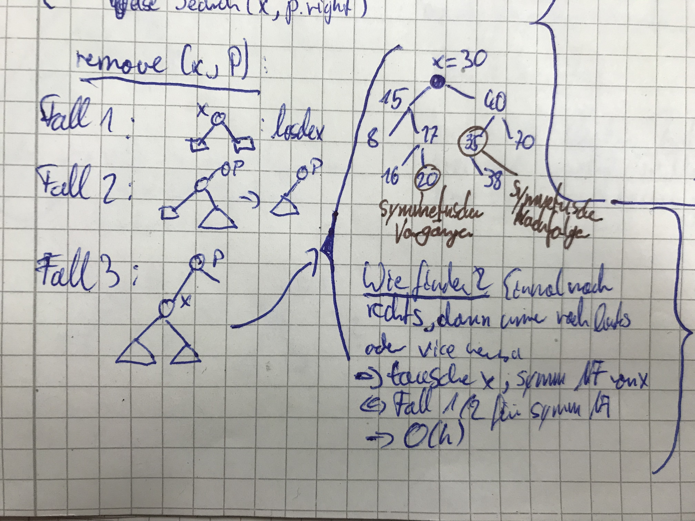

#  Datenstrukturen und Algorithmen

[TOC]

## Organisatorisches

### Team
### Webseite
### Übungen


## Graphen

### Allgemeines
-   Graphen stellen Netzwerke dar. (Soziale Netzwerke,
    Strassennetzwerke, Tram-Netzwerke, Stromnetze, Computernetze,
    Neuronale Netze)
-   Graphen vereinfachen und verbinden (einheitliche Beschreibung
    versch. Netze)
-   Graphen können gross sein (Computer und effiziente Algorithmen
    notwendig)

### Beispiele
#### Kartenfärbung
Auf einer Landkarte sollen alle Länder so gefärbt werden, dass benachbarte Länder stets verschiedene Farben haben. Es sollen möglichst wenige Farben verwendet werden.
Beobachtung: Es kommt nur darauf an, welche Paare von Ländern benachbart sind.

#### Prüfungsplanung
Eingabe: $n$ geplante Prüfungen und $k$ mögliche Termine
Ziel: weise jeder Prüfung einen Termin zu
Bedingung: zwei Prüfungen dürfen nicht gleichzeitig stattfinden, wenn ein oder mehr Studenten beide Prüfungen schreibt.
Beobachtung: Es kommt nur darauf an, welche Paare von Prüfungen durch Studenten verbunden sind.

Beide Probleme sind im Kern dasselbe Problem (Knotenfärbung). Die
Graphentheorie liefert die nötige Abstraktion um dies zu erkennen und
ermöglich die Anwendung einer Lösungsidee auf beide Probleme.

### Definition von ungerichteten Graphen
#### Definition: Graph als mathematisches Objekt

Ein Graph $G=(V,E)$ besteht aus einer Menge Knoten
$V=\{v_1, v_2, ..., v_n\}$ (engl. vertices) und einer Menge Kanten
$E=\{e_1, e_2, ..., e_m\}$ (engl. edges). Dabei ist jede Kante $e_k$
eine Menge zweier Knoten $v_i, v_j$, also $e_k=\{v_i, v_j\}$.

#### Definition: Begriffe
-   Zwei Knoten $v_i, v_j$ sind **adjazent/benachbart** in $G$, falls
    $\{v_i,v_j\} \in E$.
-   Knoten $v_i$ und Kante $e_k$ sind **inzident** in $G$, falls
    $\{v_i\} \in e_k$.
-   Die **Nachbarschaft** $N_G(v_i)$ ist die Menge der benachbarten
    Knoten von $v_i$.
-   Der **Grad** eines Knotens $v_i$ gibt die Anzahl der Nachbarn von
    $v_i$ an: $deg_G(v_i) := \mid N_G(v_i) \mid$.
-   Ein Graph $G \prime = (V \prime, E \prime)$ ist ein Teilgraph von
    $G$, falls $V \prime \subseteq V$ und $E \prime \subseteq E$.
-   Ein **Weg** ist eine Folge von Knoten
    $<v_1, ..., v_k> : {v_i, v_i+1} \in E$. Hier sind Mehrfachbesuche
    möglich.
-   Ein **Pfad** ist ein Weg ohne Mehrfachbesuche.
-   Ein **Zyklus** ist ein Weg, dessen letzter Knoten dem ersten
    gleicht.
-   Ein **Kreis** ist ein Pfad, dessen letzter Knoten dem ersten
    gleicht.
-   Ein Graph wird dann **zusammenhängend** genannt, wenn von jedem
    beliebigen Knoten zu jedem beliebigen anderen Knoten ein Weg
    existiert.
-   Die **Zusammenhangskomponente** eines Graphen ist der größte
    zusammenhängende Teilgraph des Graphen.

### Definition: Besondere Graphen 

Kreis

Pfad

Clique: Ein Graph, dessen Knoten alle mit allen anderen Knoten benachbart sind.

Stern:  Ein Graph, bei dem ein Knoten mit allen anderen Knoten verbunden ist, die anderen Knoten untereinander jedoch nicht.

Baum: Ein kreisfreier/azyklischer zusammenhängender Graph.

### Besondere Eigenschaften von Graphen

#### Summe der Knotengrade

Für jeden Graphen $G$ mit Knoten $V=\{v_1,...,v_n\}$ und Kanten
$E=\{e_1,...,e_m\}$ gilt: $\sum_{v}^{V} deg_G(v) = 2m$.

##### Beweis

**Induktionshypothese:** $A(m)$: für jeden Graph mit $m$ Kanten ist die
Summe der Knotengrade $2m$\
**Induktionsanfang:** zeige $A(1)$. Jeder Graph mit nur einer Kante hat
zwei Knoten mit Grad 1, daher ist die Summe der Knotengrade 2.\
**Induktionsschritt:** zeige $A(m-1) \rightarrow A(m)$ für alle
$m \geq 2$\
Entfernt man eine Kante von $G$ erhält man den Graphen $G'$ Auf diesen
kann die I.H. angewandt werden. $G'$ hat bis auf zwei Knoten dieselben
Knotengrade wie $G$. Die Summe der Knotengrade von $G$ ist also gleich
der Summe der Knotengrade von $G' + 2$. Durch Hinzufügen einer Kante zu
$G'$ werden die Knotengrade zweier Knoten um 1 erhöht. q.e.d.

#### Färbbarkeit und Knotengrade

Jeder Graph mit maximalem Knotengrad $\Delta$ ist $(\Delta+1)$-partit.

##### Beweis

**Induktionshypothese:** $A(n)$: Jeder Graph mit $n$ Knoten und
maximalem Knotengrad $\leq \delta$ ist $(\delta + 1)$-partit\
**Induktionsanfang:** zeige $A(1)$. Jeder Graph mit nur einem Knoten ist
$1$-partit.\
**Induktionsschritt:** zeige $A(n-1) \rightarrow A(n)$ für alle
$n \geq 2$\
Entfernt man einen Knoten $v_n$ von $G$ erhält man den Graphen $G'$ Auf
diesen kann die I.H. angewandt werden. $G'$ kann mit $\delta + 1$ Farben
gefärbt werden. Wird $v_n$ wieder hinzugefügt, hat er maximal $\delta$
Nachbarn. Daher kann $v_n$ mit der Farbe gefärbt werden, die nicht von
seinen Nachbarn verwendet wird. q.e.d.

#### Bipartite Graphen und ungerade Kreise

> Ein Graph ist bipartit genau dann wenn er keinen ungeraden Kreis
> enthält.

Hier ist erstaunlich, dass aus der Existenz von ungeraden Kreisen die
Nichtexistenz einer Färbung folgt und vice versa. Daher ist die Aussage
auch in beide Richtungen zu beweisen. Während der Beweis, dass die jeder
bipartite Kreis keinen ungeraden Kreis enthält, trivial ist, ist es die
andere Richtung (jeder Graph ohne ungeraden Kreis ist bipartit) nicht.

##### Beweis

**Induktionshypothese:** $A(n)$: Jeder Graph mit $\leq n$ Knoten und
ohne ungeradem Kreis ist bipartit\
**Induktionsanfang:** zeige $A(1)$. Jeder Graph mit nur einem Knoten ist
bipartit.\
**Induktionsschritt:** zeige $A(n-1) \rightarrow A(n)$ für alle
$n \geq 2$\
Betrachtet man einen beliebigen Graphen $G$ und "verschmilzt" alle
Nachbarn eines Knotens $v_n$ mit diesem, kann man auf den resultierenden
Graphen die I.H. anwenden. Hieraus folgt, dass alle Nachbarn des neuen
Knotens und damit alle Nachbarn der Nachbarn von $v_n$ in $G$, dieselbe
Farbe haben. Daher müssen auch alle Nachbarn von $v_n$ dieselbe Farbe
aufweisen und $v_n$ lässt sich in der anderen Farbe färben. Das
Hinzufügen von $v_n$ kann nicht zu einem ungeraden Kreis führen, da
dieser sonst auch in $G'$ vorhanden gewesen wäre.

### Gerichtete Graphen
#### Allgemeines

Ein gerichteter Graph $G=(V,E)$ besteht aus einer Knotenmenge $V$ und
einer Kantenmenge $E$, so dass jede Kante $e \in E$ ein geordnetes Paar
zweier Knoten $u,v \in V$ ist. (also: $e=(u,v)$)

#### Definition: Begriffe 
Viele Begriffe über ungerichtete Graphen lassen sich auch für gerichtete
Graphen anwenden (Richtung der Kanten muss hierbei Berücksichtigt
werden). Es gibt aber noch einige weitere Begriffe, die es für
ungerichtete Graphen nicht gibt:
-   Eine Kante $e = (u,v)$ geht von ihrem **Fuß** bis zu ihrem **Kopf**.
    Hier ist $u$ ein **Vorgänger** von $v$ und $v$ ein **Nachfolger**
    von $u$.
-   Die **Vorgängerschaft** $N_G^-(v)$ ist die Menge der Vorgänger von
    $v$.
-   Die **Nachfolgerschaft** $N_G^+(v)$ ist die Menge der Nachfolger von
    $v$.
-   **Eingangsgrad** $deg_G^-(v) := \mid N_G^-(v) \mid$
-   **Ausgangsgrad** $deg_G^+(v) := \mid N_G^+(v) \mid$
-   Eine Folge $v_1,...,v_n$ von Knoten ist eine **topologische
    Sortierung** von $G=(V,E)$, falls für jede Kante $(v_i, v_j) \in E$
    gilt, dass $i<j$ und $V={v_1,...,v_n}$.

#### Topologische Sortierung azyklischer Graphen

> Jeder azyklische gerichtete Graph hat eine topologische Sortierung.

##### Beweis

**Lemma:** Jeder gerichteter azyklischer Graph enthält eine Senke (d.h.
Ausgangsgrad 0)\
**Induktionshypothese:** $A(n)$: Jeder azyklische gerichtete Graph mit
$n$ Knoten hat eine topologische Sortierung.\
**Induktionsanfang:** zeige $A(1)$: Jeder Graph mit nur einem Knoten hat
eine topologische Sortierung.\
**Induktionsschritt:** zeige $A(n-1) \rightarrow A(n)$ für alle
$n \geq 2$\
Entfernt man $v_n$ (eine Senke, die laut Lemma existiert) aus einem
beliebigen Graphen $G$, so lässt sich auf den resultierenden Graphen
$G'$ die I.H. anwenden. Die topologische Sortierung von $G'$ ist
$v_1,...,v_{n-1}$. Daher ist $v_1,...,v_{n-1},v_n$ eine topologische
Sortierung von $G$. q.e.d.

## Graphenalgorithmen
### Gierige Knotenfärbung

```
Für alle Knoten v in G (beliebige Reihenfolge):
    Färbe v mit der ersten Farbe, die noch von keinem Nachbarn von v verwendet wird.
```
-   natürlich-sprachliche Beschreibung, dennoch präzise
-   Algorithmus entspricht Induktionsbeweis für Färbung mit $\delta + 1$ Farben

### Bipartition
```
1. Wähle beliebigen Knoten v und färbe ihn rot.
2. Setze S <- {v} und t <- 0
3. Wiederhole solange S Nachbarn in V_G \ S hat:
	1. Färbe die Nachbarn von S in V_G \ S grün.
	2. Setze S <- S vereinigt mit N_G(S) und t <- t+1.
```
-   Algorithmus findet gültige Bipartition, wenn der Graph keinen ungeraden Kreis enthält.
-   Algorithmus entspricht Induktionsbeweis für Bipartition und ungerade Kreise.

### Tiefensuche
```
1. Beginne mit Stapel S, der nur den Knoten v enthält
2. Wiederhle, solange S nicht leer ist:
    a. sei w der oberste Knoten auf Stapel S
    b. falls w als besucht markiert ist, entferne w von S
    c. falls w nicht als besucht markiert ist, markiere w als besucht und lege alle nicht besuchten Nachfolger von w oben auf S
```
- Falls zu Beginn keine Knoten markiert sind, besucht die Tiefensuche von Knoten $v$ aus genau die Knoten, die von $v$ erreichbar sind. Beweis: Induktion über die Knoten eines beliebigen Weges von Knoten $w_0$ zu Knoten $w_i$.
-   Falls zu Beginn schon eine Knotenmenge $X \subseteq V$ als besucht markiert ist, dann besucht die Tiefensuche von $v$ aus genau die Knoten, die durch Wege, die $X$ vermeiden erreichbar sind.
- Mit der Tiefensuche lassen sich Zusammenhangskomponenten finden
- Wird bei der Ausführung der Tiefensuche zu jedem Knoten notiert, wann er das erste mal auf den Stapel gelegt und wieder gelöscht wurde (Nummer der Iteration des Algorithmus), so kann aus diesen Intervallen ($pre_v$ und $post_v$) ein Tiefensuchbaum erstellt werden. In diesem lassen sich Vorwärts-, Rückwärts- und Quer-Kanten ablesen. Diese Kantentypen resultieren aus der Ausführungsreihenfolge des Algorithmus (!).
-   Werden die Knoten absteigend nach $post_v$sortiert, so ergibt sich eine topologische Sortierung

### Breitensuche
```
    1. Beginne mit dem Array dist, in dem jedes Element für einen Knoten steht und als Wert die Distanz zum gegebenen Startknoten s enthalten soll. Die Werte werden zunächst als unendlich initialisiert bis auf den Wert für s, der auf 0 gesetzt wird.
    2. Q <- Schlange mit Knoten s als einziges Element
    3. Wiederhole, solange Q nicht leer ist:
    	a. u <- dequeue(Q)
        b. Wiederhole für jeden Nachbarn v von u:
        	i. Wenn der in dist gespeicherte Wert für v gleich unendlich ist, speichere dist[v] <- dist[u]+1 und enqueue(Q,v)
```

## Repräsentationen von Graphen
### Adjazenzmatrix
#### Definition
Die Adjazenzmatrix von $G$ ist eine Matrix $A$ mit $n$ Zeilen und
Spalten, sodass für jeden Eintrag $A_{ij}$ gilt: $$A_{ij} = 
\begin{cases}
0 & (v_i,v_j) \notin E\\
1 & (v_i,v_j) \in E
\end{cases}$$
-   Laufzeit $O(1)$ für Abfrage ob eine Kante $(v_i,v_j)$ existiert
-   Laufzeit $O(n)$ für Abfrage aller Nachfolger eines Knotens

### Adjazenzliste
#### Definition
Die Adjazenzliste von $G$ ist eine Tabelle $A$ mit $n$ Einträgen, sodass
der Eintrag $A_i$ eine Liste aller Nachfolger von $v_i$ enthält.
-   Laufzeit $O(deg^+(v_i)+1)$ für Abfrage ob eine Kante $(v_i,v_j)$ existiert
-   Laufzeit $O(deg^+(v_i)+1)$ für Abfrage aller Nachfolger eines Knotens $v_i$

## Algorithmen

###Effizienz von Algorithmen
Algorithmen können effizient (bspw. Anwendung von "Logischen Schlüssen")
oder ineffizient (bspw. naives Ausprobieren) sein. Die genaue Laufzeit
eines Algorithmus hängt von vielen technischen Details ab. Diese Details
spielen keine Rolle für die Bewertung der Effizienz von Algorithmen.
Hierfür wird ein vereinfachtes Berechnungs- und Kostenmodell verwendet.

#### Allgemeines Berechnungsmodell

##### Komponenten eines Computers

Speicher: A-priori unbegrenzt viele addressierbare Speicherzellen
Prozessor:Führt elementare Operationen aus
Bus: Verbindet Prozessor und Speicher

#### Laufzeit
##### Definition

Ein Algorithmus $A$ hat die Laufzeit $f$, falls $f(n) =$ maximale Laufzeit von $A$ über alle Eingaben der Grösse $n$.
-   Anzahl der elementaren Oprationen, die der Prozessor ausführt
-   Die Grösse $n$ kann von mehreren Parametern abhängen, dann ist Laufzeit Funktion dieser Parameter

#### Asymptotische Notation

##### Definition obere Schranke

Für Funktionen $f(n)$ besteht $O(f)$ aus allen Funktionen $g(n)$, sodass
gilt: $\exists C > 0. \forall n \geq 1. g(n) \leq C * f(n)$ 
Falls $g(n) \in O(f)$, sagen wir "$g(n)$ hat die Grössenordnung
höchstens $f(n)$" oder "$f(n)$ ist bis auf konstante Faktoren beschränkt
durch $f(n)$" und schreiben $g(n) \leq O(f(n))$

##### Definition untere Schranke
Für Funktionen $f(n)$ besteht $\Omega(f)$ aus allen Funktionen $g(n)$,
sodass gilt: $\exists C > 0. \forall n \geq 1. g(n) \geq C * f(n)$\
Falls $g(n) \in \Omega(f)$, schreiben wir $g(n) \geq \Omega(f(n))$.

##### Definition asymptotisch genaues Wachstum
$\Theta(g(n)) = \Omega(g(n)) \cap O(g(n))$
$f(n) \in \Theta(g(n)) \Leftrightarrow f(n)=\Theta(g(n))$
Aufgrund der großen Unterschiede der tatsächlichen Kosten der
elementaren Operationen macht es wenig Sinn zwischen Laufzeiten von
$10*n$ und $1000*n$ zu unterscheiden.

## Algorithmenentwurf - Maximum Subarray Sum
Im folgenden wird am Beispiel des Maximum Subarray Problems der Prozess
des Algorithmenentwurfes dargestellt. Dafür werden nach einer
Vorstellung des Problems verschiedene Algorithmen betrachtet und anhand
ihrer Laufzeit miteinander verglichen.

### Das Problem
Gegeben ist eine Folge von Zahlen $a_1,...,a_n \in \mathbb{Z}$. Gesucht
ist eine Teilfolge hieraus, wobei die Summe der Elemente der Teilfolge
maximal sein soll, mindestens aber größer als 0. Sind alle Elemente der
Folge kleiner als Null, so ist die Summe gleich 0.

### Algorithmus 1: Naiv
#### Idee
Einfach alles ausprobieren
#### Pseudocode
    für i = 1...n
    	für j i...n
        	S = Summe von k=i bis j über a_k
            merke max(S)
#### Laufzeit
Schleifen können als Summen dargestellt werden. Daher ist die Laufzeit:
$\sum_{i=1}^{n}\sum_{k=i}^n(j-i)$ Dies lässt sich nach oben abschätzen
durch: $\sum_{i=1}^{n}\sum_{j=1}^{n}(n) = n^3$ und nach unten durch:
$\sum_{i=1}^{\frac{n}{3}}\sum_{j=\frac{2}{3}}^{n}(\frac{n}{3}) = \frac{n^3}{27}$
Damit lässt sich die Laufzeit auf $\Theta(n^3)$ bestimmen.

### Algorithmus 2: Vorberechnung
#### Idee
Mithilfe von vorberechneten Präfixsummen lässt sich der Rechenaufwand
verringern
#### Pseudocode
    S_0 = 0
    für i = 1...n
    	S_i = S_{i-1} + a_i
    für i = 1...n
    	für j i...n
        	S = S_j - S_{i-1}
            merke max(S)

#### Laufzeit

Die Vorberechnung ist mit einem Schleifendurchgang und jeweils einer
Operation in $O(n)$. Für das durchlaufen der beiden anderen Schleifen
mit jeweils einer Operation ist die Laufzeit hierfür $O(n^2)$. Damit
lässt sich die Laufzeit auf $\Theta(n^2)$ bestimmen.

### Algorithmus 3: Divide and Conquer

#### Idee

Teilen des Problems in kleinere Teilprobleme (hier halbiere die Folge)
Für die in der Mitte geteilte Folge gibt es drei Lösungsmöglichkeiten:

1.  Die gesuchte Teilfolge liegt in der ersten Hälfte

2.  Die gesuchte Teilfolge liegt in der zweiten Hälfte

3.  Die gesuchte Teilfolge liegt über der Trennung

Während das Finden der richtigen Lösung sehr simpel ist wird für den
dritten Fall eine nicht-triviale Eigenshcaft genutzt: Die größte Folge,
die über der Trennung liegt besteht aus der größten Suffixsumme links
der Trennung und der größten Präfixsumme rechts der Trennung.

#### Pseudocode

    n=1:
    	trivial
    n > 1:
    	teile Array in Hälften
        löse Problem für linke Hälfte
        löse Problem für rechte Hälfte
        Berechne größte Teilfolge über Trennung
        Vergleiche drei Lösungen für Gesamtlösung

#### Laufzeit

Das Bestimmen der Laufzeit ist ebenso rekursiv, wie der Algorithmus.
Während das Teilen des Arrays und der Vergleich in $O(1)$ und die
Berechnnung für eine die Trennung überlappende Teilfolge in
$O(n)$liegen, ist die Lösung für die linke und rechte Hälfte jeweils die
Laufzeit des Algorithmus halbiert, also $T(\frac{n}{2})$. Daher ergibt
sich für die Gesamtlaufzeit $T(n) = 2T(\frac{n}{2})+a * n$. Durch
teleskopieren lässt sich dies vereinfachen zu $O(n log n)$

### Algorithmus 4: Induktiv

#### Idee

Induktion über die Subarrays: Wandert man von links nach rechts durch
die Folge, so lässt sich für jedes Element untersuchen, ob es mit der
größten Suffixsumme (randmax) bis zu diesem Element ein neues Maximum
bildet.

#### Pseudocode

    max = 0
    randmax = 0
    für i=1...n
    	randmax = randmax + a_i
        if randmax > max
        	max = randmax
        if randmax < 0
        	randmax = 0

Der Algorithmus lässt sich durch Induktion beweisen.

#### Laufzeit

Da die Schleife nur einmal durchlaufen wird und dabei eine Konstante
Anzahl an Operationen unabhängig von der Eingabemenge ausgeführt wird,
ist die Laufzeit auf $O(n)$ bestimmbar.

### Die Komplexität des Problems

Die Frage, ob der induktive Ansatz den optimalen Weg zur Lösung des
Problems darstellt entspricht der Frage nach der Komplexität des
Problems. In diesem Fall lässt sich die Frage beantworten durch eine
Prüfung, ob ein Algorithmus jedes Element betrachten muss, um an die
richtige Lösung zu gelangen, wie es in unserer besten Version getan
wird. Mit einem indirekten Beweis ist schnell gezeigt, dass es so ist.
Dadurch lässt sich die Komplexität des Maximum Subarray Problems auf
$O(n)$ bestimmen.

### Komplexität und Laufzeit

Aus der Laufzeit eines Algorithmus lassen sich Aussagen über die
Komplexität des Problems treffen und vice versa. Im Folgenden steht
jeweils vor dem Pfeil die Komplexität des Algorithmus und nach dem Pfeil
die Laufzeit irgendeines Algorithmus, der das Problem löst:
$$\begin{gathered}
O(f(n)) \longleftarrow O(f(n))\\
\text{keine Aussage möglich} \longleftarrow \Omega(f(n))\\
O(f(n)) \longleftarrow \Theta(f(n))\\
O(f(n)) \longrightarrow \text{keine Aussage möglich}
\Omega(f(n)) \longrightarrow \Omega(f(n))
\Theta(f(n)) \longrightarrow \Omega(f(n))\end{gathered}$$

Algorithmenentwurf - Suche
--------------------------

Für die Suche gibt es zwei Problemstellungen. Zum einen ist die Suche
nach einem bestimmten Element in einem sortierten Array gefragt, zum
anderen soll nach einem Element in einem unsortierten Array gesucht
werden.

### Algorithmus 1: Binäre Suche im sortierten Array

#### Idee

Durch Aufteilen des Arrays kann der "Suchbereich" eingegrenzt werden.

#### Pseudocode rekursiv

    BinarySearch(A,b):
    	if A empty: "not found"
        m = floor(n/2) // nach unten gerundet
        if A[m] = b: return 
        else: BinarySearch(A[m+1-n],b) // n ist die Länge von A

#### Pseudocode iterativ

    BinarySearch(A,b):
    	l = 1; r = n;
        if l>r: return not found
        while l <= r:
        	m = floor((l+r)/2)
    		if A[m] = b: return m
            if b < A[m]: r = m-1
            else: l = m + 1

#### Laufzeit

Die Laufzeit ist bei asymptotischer Betrachtung gleich groß, egal ob
rekursiv oder iterativ gearbeitet wird. Sie kann als Rekurrenzgleichung
$T(n)=T(\frac{n}{2})+d, T(1)=c$dargestellt werden. Das ist dasselbe wie
$T(n)=c+log_2(n) * d \leq \mathcal{O}(log(n))$.

### Algorithmus 2: Interpolationssuche im sortierten Array

#### Idee

Mithilfe einer guten Schätzung kann der Index $m$ angenähert werden.

#### Formel für m

$$m=floor(l+\frac{b-A[n]}{A[l]-A[r]}(r-l))$$

#### Laufzeit

Worst case: $\mathcal{O}(n)$\
Best case: $\mathcal{O}(log(log(n)))$

### Komplexität des Problems

Wird die vergleichsbasierte Suche als Entscheidungsbaum betrachtet, so
ist die Anzahl der Knoten in dem Baum $n$, die Höhe des Baumes $h$. In
dieser Modellierung ist die minimale Höhe des Baumes die untere Schranke
der Komplexität des Problems. Ein binärer Baum der Höhe $h$ hat
höchstens $2^{h+1}-1 < 2^h$ Knoten. Dadurch folgt direkt, dass $n<2^h$
ist, wodurch $h > log_2(n)$ folgt. Damit ist die Komplexität des
Problems bei $\Omega(log(n))$.

### Algorithmus 3: Lineare Suche im unsortierten Array

#### Idee

Das gesamte Array wird Schritt für Schritt abgesucht.

#### Pseudocode

    LinearSearch(A,b):
    	for i=1...n:
        	if A[i] == b: return i
        return 'not found'

#### Laufzeit

$\mathcal{O}(n)$

### Komplexität des Problems

Argument 1: Das b muss mit allen Elementen im Array verglichen werden.
Argument 2: Da Argument 1 auslässt, dass auch innerhalb des Arrays
Vergleiche angestellt werden können um die Laufzeit zu verringern, muss
dies in einer anderen Betrachtung berücksichtigt werden. In diesem Fall
kann ein Algorithmus zunächst $r$ Vergleiche im Array durchführen und es
so in Gruppen einteilen. Um diese Gruppen zu verschmelzen müssen aber
für jedes Paar zweier Gruppen mindestens ein Vergleich angestellt
werden. Vergleicht man nun b mit allen Gruppen, so erhält man
schließlich mindestens $n$ Vergleiche. $\Omega(n)$ ist also tatsächlich
die Komplexität des Problems.

Algorithmenentwurf - Sortieren
------------------------------

### Das Problem

Input: Array $A$ der Länge $n$. Output: Permutation $A'$ von $A$, sodass
die Werte in $A'$ aufsteigend sortiert sind.

### Algorithmus 0: Prüfung
```
isSorted(A):
	for i=1...n-1:
    	if A[i] > A[i+1]: return false
    return true
```
### Algorithmus 1: BubbleSort

#### Idee

Naives verschieben großer Elemente an das Ende

#### Pseudocode
```
BubbleSort(A):
    for j=1...n-1
    	for i=1...n-1
        	if A[i] > A[i+1]: swap(A[i], A[i+1])
```
#### Laufzeit

Nach Verbesserungen:
$$\sum_{j=1}^{n-1}\sum_{i=1}^{n-j}1=\sum_{j=1}^{n-1}(n-j) \leq O(n^2)$$

### Algorithmus 2: SelectionSort

#### Idee

Induktiver Ansatz: baue die Lösung von links nach rechts. Iteriere über
den Array, wobei zu jedem Zeitpunkt alles schon betrachtete korrekt ist,
d.h. alle Elemente sind an der richtigen Stelle. Rechts von der aktuell
betrachteten Position ist dabei alles unsortiert.

#### Pseudocode
```
SelectionSort(A):
	for i=1...n-1
    	j=Index vom Minimum in A[i...n]
        swap(A[i],A[j])
```
#### Laufzeit

Für die Minimumsuche: $n-i$\
Gesamt:
$$\sum_{i=1}^{n-1}(n-i)=n-1+n-2+n-3+...+1=\frac{n(n-1)}{2} \leq O(n^2)$$

### Algorithmus 3: InsertionSort

#### Idee

Induktiv wie SelectionSort. Hier sind aber die Elemente links des
betrachteten Elementes nur sortiert, nicht bereits an der richtigen
Stelle.

#### Pseudocode
```
InsertionSort(A):
    for i=1...n-1
		j=BinarySearch(A[1...i], A[i+1]) //findet Stelle, an der eingesetzt werden muss
    A[j] = A[i+1]
    A[j+1...i+1] = A[j...i] //verschiebe Array
```
#### Laufzeit

$O(n log n)$ Vergleiche und $O(n^2)$ Tauschoperationen.

### Algorithmus 4: Heapsort

#### Idee

Aufbau eines Max-Heaps. Die Eingabe ist hier der Array, der zunächst zu
einem Heap umgeformt werden muss.

#### Pseudocode
```
HeapSort(A):
	for i=floor(n/2)...1: 
    	restoreHeapCondition(A,i,n)
    for i=n...2:
        swap(A[i],A[1])
        restoreHeapCondition(A,1,i-1)
```
#### Laufzeit
Anzahl der Vergleiche:
$0*2^d+2*2^{d-1}+...+2d*2^{d-d} = \sum_{i=1}^{d-1}2^i*s(d-i) \leq O(2^d) = O(n)$.
Aber: $n$ calls der restoreHeapCondition Funktion, daher $O(nlogn)$

### Algorithmus 5: MergeSort

#### Idee

Divide-and-Conquer

#### Pseudocode
```
MergeSort(A,l,r):
    if l<r:
        m=floor((l+r)/2)
        MergeSort(A,l,m)
        MergeSort(A,m+1,r)
        Merge(A,l,m,r)

Merge(A,l,m,r):
    i=l
    j=m+1
    k=l
    while i <= m && j <= r:
    	if A[i]  < A[j]:
    		B[k]=A[i]
            i++
            k++
    	else:
            B[k] = A[j]
            j++
            k++
    use rest left to right
    A = B
```
#### Laufzeit

$$T(n) = 2 T(\frac{n}{2}+cn \leq O(nlogn)$$ Wichtig: Extraspeicher
$O(n)$ !!!

### Algorithmus 6: QuickSort

#### Idee

In dem Array wird ein Pivotelement gewählt und an die richtige Stelle
vertauscht, sodass alle Elemente links davon kleiner, und alle Element
rechts davon größer sind.

#### Pseudocode
```
QuickSort(A,l,r):
    k=Aufteilen(A,l,r)
    QuickSort(A,l,k-1)
    QuickSort(A,k+1,r)

Aufteilen(A,l,r): //Pivot ist hier immer mostright
    i=l
    j=r-1
    p=A[r]
    repeat:
        while i<r and A[i]<p: i++
        while j>l and A[j]>p: j++
        if i<j: swap(A[j],A[i])
    until i >= j
    swap(A[i],A[r]) // Pivottausch
    return i
```
#### Laufzeit

Abhängig von der Pivotwahl. Best case: $O(n log n)$, Worst case
$O(n^2)$.

### Komplexität des Problems

Wird die vergleichsbasierte Sortierung als Entscheidungsbaum betrachtet,
so ist die Anzahl der Knoten in dem Baum $n$, die Höhe des Baumes $h$.
In dieser Modellierung ist die minimale Höhe des Baumes die untere
Schranke der Komplexität des Problems. Die Blätter des Baumes
entsprechen den Permustationen des Eingabearrays ($n!$). Ein Baum der
Höhe $h$ hat maximal $2^h$ Blätter. Daher gilt hier
$2^h \geq n! \Longrightarrow n \geq log(n!) \geq \Omega(nlogn)$.


## Abstrakte Datentypen & Datenstrukturen

###Abstrakte Datentypen

####ADT Stapel (engl. stack)

-   LIFO = last in, first out
-   top() fragt oberstes Objekt ab
-   push() legt neues Objekt auf den Stapel
-   pop() entfernt oberstes Objekt vom Stapel
-   push(), pop() und top() haben jeweils $O(1)$

#### ADT Schlange (engl. queue)

-   FIFO = last in, first out
-   top() fragt vorderstes Objekt ab
-   enqueue() fügt neues Objekt der Schlange hinzu
-   dequeue() entfernt vorderstes Objekt
-   push(), pop() und top() haben jeweils $O(1)$

#### ADT Priority Queue

* insert(x, P): fügt x ein
* extractMax(P): entfernt Maximum

#### ADT Wörterbuch (Dictionary)

* search(x,W): x in W
* insert(x,W): füge x ein
* remove(x,W) entferne x falls vorhanden

### Datenstrukturen

#### Linked List

* Besteht aus Elementen mit Schlüssel und Zeiger auf nächstes Element.
* Verwendung bei Stack und Queue
* Operationen in $\mathcal{O}(1)$

#### Heap

* Verwendung bei Priority Queue
* Darstellung als Baum möglich, implementiert als Array
* Operationen in $\mathcal{O}(log(n))$
* genaue Beschreibung fehlt!!!

#### Binary Search Tree

##### Natural Search Tree

* Aufbau wie Linked List, aber mit zwei Zeigern. Dadurch Baumstruktur.
* Problem: Höhe sehr variabel, daher ineffizient

###### Suche

```
search(x, p):
	if p = null: return "not found"
	if p.key = x: return "found"
	if x < p.key: search(x, p.left)
	if x > p.key: search(x, p.right)
```

$\Longrightarrow \mathcal{O(h)}$ mit $h$ als Höhe des Baumes

###### Entfernen



#### AVL-Baum

* Lösung der Effizienzprobleme natürlicher Suchbäume
* Neue Bedingung: bei jedem Knoten, darf der Unterschied zwischen der Höhe des linken und rechten Teilbaums höchstens 1 betragen.
* Da dir Anzahl der Blätter für eine Höhe des Baumes berechenbar ist mit den Fibonaccizahlen, kann die Höhe als $\Theta(log(n))$ angegeben werden
* Mit Fallunterscheidung und klugem Nachdenken lassen sich Einfügen und Entfernen durch Rotation und Doppelrotation in $\mathcal{O}(log(n))$ implementieren.

## Dynamische Programmierung

Dynamische Programmierung ist im Prinzip nichts anderes als Induktion. DP besteht aus zwei wesentlichen Komponenten:

1. Design der Induktion
   1. Wie kann das Problem in sinnvolle, einfachere Teilprobleme aufgeteilt werden?
2. Bottom-up-Berechnung
   1. Berechnen der Lösung beim Startpunkt der Induktion
   2. Ähnliche Vorgehensweise, wie bei rekursiver Berechnung, aber mit Merken von zwischenergebnissen → Memoization

### Beispiele

#### Beispiel 1: Längste aufsteigende Teilfolge (LAT)

Über mehrere Zwischenschritte, die alle entweder falsch oder zu ineffizient sind, gelangt man schließlich zur Lösung:

Invariante: Wir merken uns für jede Länge der Teilfolgen das letzte Element der Teilfolge der jeweiligen Länge, in der das letzte Element das kleinstmögliche ist. Daher lässt sich für das Einlesen eines weiteren Elemnts folgende Fallunterscheidung aufstellen:

1. Wenn das Element größer ist, als das letzte Element, kann es als letztes Element einer neuen Länge gespeichert werden
2. Passt es nocht, so kann der Endwert einer anderen Teilfolge gesenkt werden. Die zu ändernde Teilfolge ist die kürzeste, bei der das letzte Element größer ist, als das neue Element.

Der so erstellbare Algorithmus hat eine Laufzeit von $\mathcal{O}(nlog(n))$, da für jedes Element, eine binäre Suche durchgeführt wird, um die richtige Stelle zu finden. Der Speicherbedarf liegt bei $\mathcal{O}(n)$, denn es wird eine Tabelle erstellt die maximal $n$ Elemente speichern wird.

#### Beispiel 2: Längste gemeinsame Teilfolge (Alignment)

Durch eine Fallunterscheidung lässt sich die längste gemeinsame Teilfolge finden und in eine Tabelle schreiben.

| LGT  |  _   |  T   |  I   |  G   |  E   |  R   |
| :--: | :--: | :--: | :--: | :--: | :--: | :--: |
|  _   |  0   |  0   |  0   |  0   |  0   |  0   |
|  Z   |  0   |  0   |  0   |  0   |  0   |  0   |
|  I   |  0   |  0   |  1   |  1   |  1   |  1   |
|  E   |  0   |  0   |  1   |  1   |  2   |  2   |
|  G   |  0   |  0   |  1   |  2   |  2   |  2   |
|  E   |  0   |  0   |  1   |  2   |  3   |  3   |

Hier gilt: 
$$
\begin{align*}
T[x,y] = max\{&\\
	&LGT(x-1,y), \\
	&LGT(x, y-1), \\
	&LGT(x-1, y-1), \\
	&LGT(x-1,y-1)+1\\\
	\}
\end{align*}
$$
Wobei der letzte Fall (mit Addition) nur auftritt, wenn $A[x]=B[y]$.

Diese Algorithmus hat eine Laufzeit und einen Speicher von $\mathcal{O}(mn)$.

#### Beispiel 3: Minimale Editierdistanz

Für zwei gegebene Zeichenfolgen $A$ und $B$ wird berechnet wie viele der folgenden elementaren Bearbeitungsoperationen verwendet werden müssen, um aus der einen Zeichenfolge die andere zu erhalten:

* Ein Zeichen durch ein anderes ersetzten
* Ein Zeichen löschen
* Ein Zeichen einfügen

Auch hier lässt siche ine Fallunterscheidung anwenden, um zu einer DP Tabelle zu gelangen:
$$
\begin{align*}
EDT[n,m] = min\{&\\
	&EDT(n-1,m)+1, \\
	&EDT(n, m-1)+1, \\
	&LGT(n-1, m-1)+1, \\
	&LGT(n-1,m-1)\\\
	\}
\end{align*}
$$
Wobei auch hier der letzte Fall nur auftritt, wenn die beiden Zeichen gleich sind.

#### Beispiel 4: Matrixkettenmultiplikation

Die Multiplikation mehrerer Matrizen $A_1,...,A_n$ ist assoziativ, aber unterschiedliche Reihenfolgen der Multiplikation sind unterschiedlich zeitaufwändig. Daher gilt es, die beste Klammerung zu finden.

Dieses Problem wird aufgeteilt, denn eine optimale Klammerung von $A_1...A_n$ besteht aus der Multiplikation von $A_1...A_i$ und $A_{i+1}...A_n$, sowie der optimalen Klammerung für diese beiden Teilprodukte. Es ergibt sich so die Rekurrenzgleichung: $T(p,q)=min_{p \leq i< q} \{T(p,i)+T(i+1,q)+C_{p,i,q}\}$. Hier sind $T(p,q)$ die optimale Klammerung von $A_p...A_q$ und $C_{p,i,q}$ die Kosten der Multiplikation von $A_p...A_i$ und $A_{i+1}...A_q$.

Mit einer $n \times n$ DP-Tabelle, in der jeder Eintrag $T(p,q)$ in $O(n)$ berechnet werden kann lässt sich dieses Problem in $O(n^3)$ lösen.

#### Beispiel 5: Teilsummenproblem

Nun haben wir eine Menge natürlicher Zahlen, sowie eine andere natürliche Zahl $b$. Wir suchen nach einer Teilmenge, sodass die Summe aller Elemente der Teilmenge gleich $b$ ist. Die Lösung dieses Problems ist naiv nur in $O(2^n)$ lösbar, weswegen wir DP verwenden.

Es lässt sich feststellen, dass falls ein Lösung für $a_1,...,a_n$ existiert, dann ist entweder $b$ oder $b-a_n$ eine Teilsumme von $a_1,...,a_{n-1}$. Dadurch entsteht die Rekurrenzgleichung $T(k,s)=T(k-1,s) \lor T(k-1,s-a_k)$. Hieraus l¨åsst sich eine Tabelle berechnen und so das Problem in $O(bn)$ lösen.

Diese Laufzeit wird pseudopolynomiell genannt, da sie bspw. für $b=2^n$ nicht in polynomieller Zeit gelöst werden kann. Ist $b$ allerdings polynomiell in $n$, so ist die Laufzeit polynomiell.

#### Beispiel 6: Rucksackproblem

Hier geht es darum, eine Teilmenge aus Menge von Paaren $(v,w)$ zu wählen, sodass die Summe der $v$ Werte maximiert wird, die Summe der $w$ Werte eine bestimmte Schranke $W$ aber nicht übersteigt. Wie beim Teilsummenproblem lässt sich dieses Problem in Teilprobleme zerlegen und eine Rekurrenz hierfür aufstellen: $T(i,W)=max\{T(i-1,W), v_i+T(i-1,W-w_i)\}$. Auch hier ist die Tabelle nur in $O(n * W)$ berechenbar, sodass auch dieser Algorithmus pseudopolynomiell ist.

#### Beispiel 7: Wege von $u$ nach $v$ in Graphen zählen
Gegeben ist ein gerichteter Graph $G$, zwei Knoten $u,v \in V(G)$ und eine Länge $L$. Gesucht ist die Anzahl der Wege in $G$ von $u$ nach $v$ der Länge $L$.

Einsicht: Jeder Weg der Länge $L$ von $u$ nach $v$ besteht ais einem Weg von $u$ zu einem Knoten $w$ der Länge $L-1$ und einer Kante von $w$ nach $v$. 

Die Zerlegung in Teilprobleme gibt uns die Funktion $T^{(l)}(i,k)$, die die Anzahl der Wege von $i$ nach $k$ der Länge $l$ gibt. Es gilt die Rekurrenzgleichung $T^{(l)}(i,k) = \sum_{j:(j,k) \in E(G)}T^{(l-1)}(i,j)$.

Erstellt man eine entsprechende Tabelle, so stellt man fest, dass $T^{(l)}=A^l$, wobei $A^l$ die $l$-te Potenz der Adjazenzmatrix des Graphen ist. So kann man Matrixmultiplikation als einfache Form der dynamischen Programmierung ansehen.

#### Beispiel 8: Kürzeste Wege in Graphen (Bellman-Ford)
Gegeben ist ein gerichteter Graph $G=(V,E)$, zwei Knoten $s,t \in V$ und Gewichte $w: E \longleftarrow \mathbb R$. Gesucht ist der Weg von $s$ nach $t$ in $G$ mit kleinstem Gewicht.

Es kann festgestellt werden, dass es positive Zyklen (Wege mit beliebig großem Gewicht), negative Zyklen (Wege mit beliebig kleinem Gewicht) und "neutrale" Zyklen (Wege mit Geiwcht 0) gibt. 

Sind alle Gewichte gleich und positiv, so ist der beste Algorithmus die Breitensuche, da der kürzeste Weg auch der mit geringstem Gewicht ist.

Einsicht 1: Der optimale Weg von $s$ nach $t$ besteht aus einem optimalen Weg von $s$ zu einem Knoten $i$ und der Kante von $i$ nach $t$. Daraus lässt sich die Rekurrenzgleichung erstellen: $T(j)=min_{i:(i,j) \in ET(i)+w(i,j)}$. Leider hat diese Rekurrenz keinen Bezug zu kleineren Teilproblemen, weswegen ein neuer Ansatz gewählt werden muss.

Einsicht 2: Um unseren Ansatz zu retten, verändern wir die Rekurrenzgleichung so, dass der optimale Weg von $s$ nach $i$ eine Kante weniger enthält, als der optimale Weg von $s$ nach $t$: $T(j,l)=min\{T(j,l-1),min_{(i,j)\in E}T(i,l-1)+w(i,j)\}$.

Dieser Ansatz funktioniert besser und wird auch Bellman-Ford Algorithmus genannt.

#### Beispiel 9: Alle kürzesten Wege (Floyd-Warshall)
Anstatt den Bellman-Ford Algorithmus $n$ mal auszuführen, kann ein neuer Algorithmus verwendet werden, wenn alle kürzesten Wege in einem Graphen gefunden werden sollen.

Gegeben ist jetzt ein gerichteter Graph $G=(V,E)$ mit Gewichten $w: E \longrightarrow \mathbb R$. Gesucht ist eine Tabelle $D(i,j)=$ minimales Gewicht eines $i$-$j$-Weges. Das Problem wird aufgeteilt in $T^{(k)} (i,j) = $ minimales GEwicht eines Weges von $i$ nach $j$ mit allen Zwischenknoten in $1,...,k$. Nun kann die folgende Rekurrenz aufgestellt werden:
$$T^{(k)}(i, j) = min\{T^{(k−1)}(i, j), T^{(k−1)}(i, k) + T^{(k−1)}(k, j)\}$$
Die Laufzeit beträgt nun insgesamt $\mathcalO(n^3)$, da $n^3$ Einträge mit einer Laufzeit von $\mathcal O(1)$ berechnet werden.

### Approximation für pseudopolynomielle Algorithmen

Um pseudopolynomielle Laufzeiten zu umgehen, kann man die Eingaben verändern, sodass zwar das Ergebnis nicht ganz korrekt, dafür aber effizient berechnet werden kann.

##### Approximationsschema für das Rucksackproblem

Seien die Gewichte $w_1,...,w_n \in \mathbb N$, die Werte $v_1,...,v_n \in \mathbb N$ und die Gewichtsschranke $W\in \mathbb N$ gegeben. Es kann ein $K \in \mathbb N$ gewählt werden, sodass für **gerundete Nutzwerte** $v_i'=\lfloor\frac{v_i}{K}\rfloor$ eine optimale Lösung gefunden werden kann. Sei $V=v_1+...+v_n$ und angenommen wird, dass alle $w_i \leq W$ sind, so kann die Laufzeit als $O(nV/K)$ bestimmt werden.

Betrachten wir jetzt die beiden Optimalen Lösungen $S$ für die Originalwerte und $S'$ für die neuen Werte, so lässt sich folgendes sagen: Da $S'$ optimal für alle Werte $v_i'$ ist, gilt: $\sum_{i\in S'}v_i' \geq \sum_{i\in S}v_i'$ . Außerdem gilt $v_i \geq K * v_i' \geq v_i-K$, denn $v_i-Kv_i'\leq 1​$. Daher gilt: 

$$
\sum_{i \in S'}v_i \geq K*\sum_{i \in S'}v_i' \geq \sum_{i \in S} v_i' \geq \sum_{i \in S} v_i-n*K
$$

Folglich ist $\sum_{i\in S'}v_i\geq\sum_{i \in S} v_i-nK$.

Für ein $K=\epsilon V/n^2$ gilt daher
$$
\sum_{i\in S'}v_i \geq \sum_{i \in S}v_i-\epsilon V/n \geq (1-\epsilon)\sum_{i\in S}v_i
$$
sowie
$$
O(nV/K)=O(n * n^2/\epsilon)
$$

## Minimale Spannbäume

### Einführung
Ein Spannbaum eines ungerichteten Graphen ist ein Teilbaum, der alle Knoten des Graphen enthält, aber nur (N-1) Kanten, sodass der Teilgraph kreisfrei ist. Minimale Spannbäume sind dann wichtig, wenn der Graph gewichtet ist. Sie sind die Spannbäume, deren Kantengewichte aufsummiert minimiert sind. Anwendung finden minimale Spannbäume beim Netzwerkdesign, in der Bildsegmentierung oder auch in Clusteringverfahren, wie sie für genetische Distanzen verwendet werden.

### Drei Ansätze zur Problemlösung
1. Wähle $n-1$ Kanten mit minimalem Gewicht, sodass kein Kreis entsteht
2. Wähle $n-1$ Kanten, sodass alle Knoten zusammenhängend sind
3. Entferne $m-n+1$ Kanten mit maximalem Gewicht, sodass alle Knoten zusammenhängend bleiben

### Erster Ansatz: Kruskals Algorithmus
1. Sortiere Kanten aufsteigend nach Gewicht
2. Wähle die ersten $n-1$ Kanten und überspricnge Kanten, deren Wahl einen Kreis erzeugen würde

### Zweiter Ansatz: Prims Algorithmus
1. Starte mit einem beliebigen Knoten als Teilgraph $S$
2. Füge diejenige Kante zu $S$ hinzu, die das leichteste Gewicht aller Kanten, die von einem Knoten in $S$ zu einem Knoten außerhalb on $S$ gehen, hat

### Dritter Ansatz: Rückwärts Kruskal
1. Sortiere alle Kanten absteigend nach Gewicht
2. Entferne nach und nach $m-n+1$ Kanten, ohne dass zwei Zusammenhangskomponenten entstehen

### Korrektheitsbeweise
Um die Korrektheit der drei Algorithmen beweisen zu können, sind zwei Prinzipien nötig, die die Struktur minimaler Spannbäume beschreiben und fundamentaler Eigenschaften dieser sind. Die Voraussetzung für diese Prinzipien ist die Unterschiedlichkeit aller Kantengewichte.

#### Kreisprinzip
Sei $C$ ein Kreis im Geaphen und $e$ die Kante mit maximalem Gewicht in $C$, dann enthält kein minimaler Spannbaum die Kante $e$. 
##### Rückwärts-Kruskal
Der dritte Algorithmus verwendet dieses Prinzip, denn er entfernt jeweils die teuerste Kante, die auf einem Kreis liegt.

#### Schnittprinzip
Betrachtet man die nicht-triviale Teilmenge $S$ von der Knotenmenge $V$ eines Graphen, so existiert unter allen Kanten mit genau einem Endpunkt in $S$ eine Kante $e$ mit geringstem Gewicht. Jeder minimale Spannbaum enthält diese Kante.
##### Prim
Der zweite Algorithmus wählt nur diejenigen Kanten aus, die das Schnittprinzip erfüllen, da immer die leichteste Kante $e$ aus $S$ heraus gewählt wird.
##### Kruskal
Da Kruskals Algorithmus immer zwischen denjenigen Kanten die leichteste auswählt, die zwei Zusammenhangskomponenten verbinden, erfüllen alle von Kruskal gewählten Kanten das Schnittprinzip.

### Die Union-Find Datenstruktur
Nach zwei falschen Ansätzen gelangt man zu einer Datenstruktur, mit deren Hilfe sich Kruskals Algorithmus implementieren lässt. Für diese wird ein Array `rep` der Länge $N$ erstellt. Die Idee dahinter ist, dass jede Zusammenhangskomponente einen Knoten in ihr als Repräsentanten hat. Nun ist für jeden Knoten $u$ der Repräsentant für die Zusammenhangskomponente, in der sich $u$ befindet, in `rep[u]` gespeichert.
#### Operationen 
##### `make(V)`
Setze `rep[u] = u` für alle $u$ in $V$. Dies ist möglich in $\mathcal O(n)$.
##### `find(u)`
Gebe `rep[u]` aus. Dies ist möglich in $\mathcal O(1)$.
##### `union(u,v)`
Vergleiche die Größen der Zusammenhangskomponenten von $u$ und $v$. Mache den Repräsentanten der größeren zum Repräsentanten der Vereinigung beider ZHKs. Dies ist möglich in $\mathcal O(min(|ZHK(u)|,|ZHK(v)|))$.

### Pseudocode für Kruskal
```
T <- empty set
für alle Kanten e in E sortiert nach aufsteigendem Gewicht:
    falls T vereinigt mit {e} keinen Kreis enthält:
        T <- T vereinigt mit {e}
```
dies entspricht mit der union-find Datenstruktur folgendem:
```
T = make(V)
für alle Kanten e={u,v} in E sortiert nach aufsteigendem Gewicht:
    falls find(u)!=find(v):
        T <- union(u,v)
```

## Kürzeste Wege
Wir haben bereits mit Floyd-Warshall und Bellman-Ford zwei Algorithmen zur Berechnung der kürzesten Wege gesehen, da diese jedoch eine relativ lange Laufzeit haben, ist es erstrebenswert, auch andere Algorithmen zu betrachten. Aus den im Folgenden beschriebenen Algorithmen lässt sich folgende Tabelle erstellen:

| Graph                                      | one-to-all                              | all-to-all                                         |
|:-------------------------------------------|:----------------------------------------|:---------------------------------------------------|
| $G=(V,E)$                                  | Breitensuche. $\mathcal O(m+n)$         | $n$ mal Breitensuche. $\mathcal O(mn+n^2)$         |
| $G=(V,E,c)\;c:E\longrightarrow\mathbb R^+$ | Dijkstra. $\mathcal O(m+n\cdot log(n))$ | $n$ mal Dijkstra. $\mathcal O(mn+n^2\cdot log(n))$ |
| $G=(V,E,c)\;c:E\longrightarrow\mathbb R$   | Bellman-Ford. $\mathcal O(mn)$          | Floyd-Warshall. $\mathcal O(n^3)$                  |

### Dijkstra
Der Dijkstra-Algorithmus dient dazu, in einem positiv gewichteten Graph $G=(V,E,c)\;c\longrightarrow R^+$ die kürzesten Wege von einem Knoten zu allen anderen zu berechnen. Die Idee dahinter ist, in jedem Schritt einen Knoten zu der Menge aller Knoten zu denen der kürzeste Weg bekannt ist und obere Schranken für alle Knoten, die sich noch nicht in der Menge befinden festzusetzen. Der neue Knoten ist dann immer der mit der geringsten oberen Schranke, da es keinen kürzeren indirekten Weg zu ihm geben kann.
##### Pseudocode
```
S = leere Menge
d(u) = infty für u != s
while |S| < n:
    finde v mit minimalem $d(v)$
    S = S vereinigt mit {v}
    für alle (u,v) in E mit w in V ohne S:
        d(w) = min(d(w), d(v)+c(v,w))
``` 
##### Laufzeit
Mit eine Fibonacci-Heap lässt sich dieser Algorithmus in $\mathcal O(m+n\cdot log(n))$ implementieren.

### Johnsons Algorithmus
Um Dijkstras Algorithmus für eine all-to-all-Suche in einem Graphen mit negativen Gewichten $G=(V,E,c)\;c\longrightarrow R$ anwenden zu können, müssen alle Gewichte positi gemacht werden. Um dies zu erreichen, können die Gewichte nicht einfach um den Betrag des kleinsten Gewichts erhöht werden, da dies die kürzesten Wege verändert. Stattdessen wird der Algorithmus von Johnson angewandt:
Die Idee besteht darin einen neuen Knoten zu definieren, der mit allen Knoten mit einer Kante vom Gewicht 0 verbunden ist. Anschließend wird für jeden Knoten in $G$ eine Höhe $h$ berechnet, die dem Gewicht des kürzesten Weges vom neuen Knoten zu dem Knoten entspricht. Dies kann mit dem Bellman-Ford Algorithmus erzielt werden. zum Schluss werden neue Kantengewichte $\hat c$ definiert als: $\hat c(u,v) = c(u,v) + h(u) - h(v)$. Mit diesen neuen Gewichten kann nun $n$ mal der Dijkstra-Algorithmus angewandt werden.
##### Laufzeit
Neuer Knoten und entsprechende Kanten: $\mathcal O(n)$. Höhen (Bellman-Ford): $\mathcal O(mn)$. $n$ mal Dijkstra: $\mathcal O(mn+n^2\cdot log(n))$. Insgesamt benötigt der Algorithmus also $\mathcal O(mn+n^2\cdot log(n))$. Damit ist er für dünn besetzte Graphen schneller, als der Floyd-Warshall-Algorithmus.
